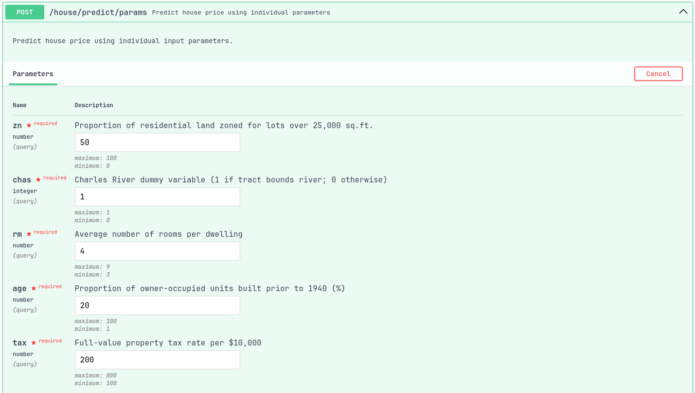
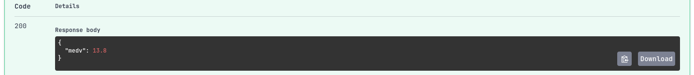
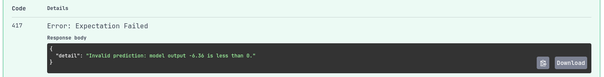

# House Price Prediction API - Demo

This branch demonstrates the working **House Price Prediction API** with screenshots of input and output.

---

## 🏠 Demo Overview

The API predicts house prices using a **simplified version of the Boston Housing dataset**.  

## 📸 Input Fields

Users enter the values manually in the API input form.  
Example screenshot:



---

## ✅ Example of a Good Prediction

The model predicted a valid, positive house price.  
Screenshot showing **200 OK response**:



---

## ❌ Example of a Bad Prediction

If the model predicts a **negative price**, the API raises an exception (`417 Expectation Failed`).  
Screenshot showing **417 response**:



---

## 📁 Project Structure (Demo)

```

demo
└── output
    ├── all fields # model stats with all fields included
    ├── no age     # model stats without 'age' field
    └── no indus   # model stats without 'indus' field

```
